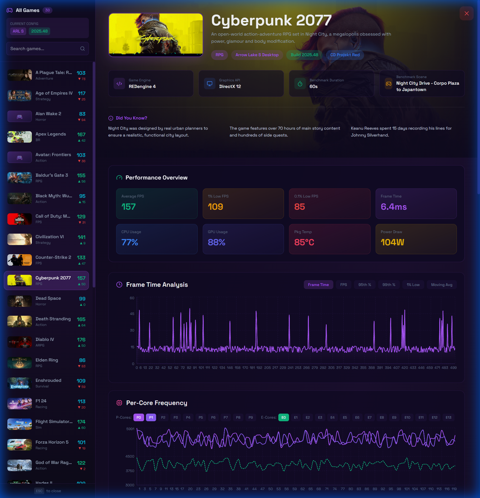

# Intel Gaming Performance Dashboard

A high-performance, React-based dashboard for tracking and analyzing gaming performance metrics across Intel CPU programs (Arrow Lake, Nova Lake, Panther Lake).



## 🚀 Key Features

-   **Detailed Analysis**: Deep dive into frame times, per-core frequency/temperature, and power analysis.
-   **Sticky Header**: Persistent game context (Name, SKU, Build) while scrolling through detailed metrics.
-   **Deep Linking**: Shareable URLs for specific programs, SKUs, games, and builds (e.g., `?build=2025.48`).
-   **Build Selection**: Compare performance across different software builds directly from the sidebar.
-   **Lazy Loading**: Optimized route loading for fast initial startup.
-   **Interactive Charts**: Dynamic visualization using Recharts for frame times, trends, and hardware stats.
-   **Demo Mode**: A hands-free, cinematic showcase mode optimized for large screens (TVs), featuring auto-cycling games, "curtain" transitions, and large-scale visuals.
-   **"Did You Know?"**: Fun facts for all 38 supported games.

## 🛠️ Tech Stack

-   **Core**: React 18, Vite
-   **Styling**: Tailwind CSS
-   **Routing**: React Router DOM v6
-   **Visualization**: Recharts
-   **Icons**: Lucide React

## 📂 Project Structure

```
src/
├── components/
│   ├── cards/          # Reusable UI cards (Game, SKU, Metric)
│   ├── charts/         # Chart components (Analysis, Comparison)
│   ├── common/         # Shared components (Badges, Images)
│   ├── overlay/        # Game details overlay
│   └── pages/          # Main route pages (Landing, Dashboard)
├── data/               # Static data (Games, Programs, Builds)
└── utils/              # Helper functions and data generators
```

## ⚡ Quick Start

1.  **Install Dependencies**
    ```bash
    npm install
    ```

2.  **Run Development Server**
    ```bash
    npm run dev
    ```
    Open [http://localhost:5173](http://localhost:5173)

3.  **Build for Production**
    ```bash
    npm run build
    ```
    Output will be in the `dist/` directory.

## 📦 Deployment

The project is static-site ready. You can deploy the `dist/` folder to:
-   **Azure Static Web Apps** (Recommended)
-   **Vercel / Netlify**
-   **GitHub Pages**
-   **Azure Blob Storage** (Static Website)

## 🤝 Contributing

1.  Fork the repository
2.  Create a feature branch (`git checkout -b feature/amazing-feature`)
3.  Commit changes (`git commit -m 'feat: Add amazing feature'`)
4.  Push to branch (`git push origin feature/amazing-feature`)
5.  Open a Pull Request

---
*Internal Tool - Intel Gaming Performance Team*
