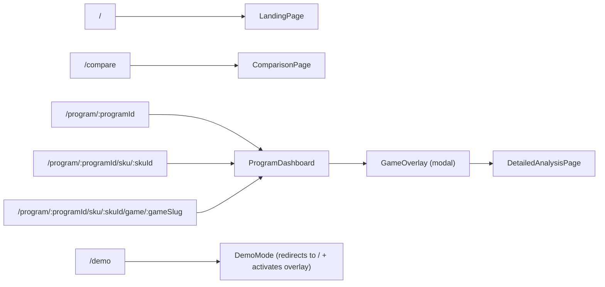

# 🎮 Intel Gaming Performance Dashboard — Complete Repository Walkthrough

## 🚀 Live Deployment
**Dev Server Running at:** [http://localhost:5173](http://localhost:5173)

````carousel

<!-- slide -->

<!-- slide -->

````

---

## 🎨 Theme & Design Language

The dashboard follows a **dark cyberpunk/deep-space aesthetic** built for internal Intel validation engineers.

| Token | Value | Purpose |
|---|---|---|
| **Background** | `#0f0a1e` (deep purple-black) | Root bg |
| **Gradient** | `from-background via-[#1a0f2e] to-[#0d0a18]` | App shell |
| **Primary** | Purple `#a855f7` / `#7c3aed` | Arrow Lake, accents |
| **Secondary** | Cyan `#22d3ee` | Nova Lake |
| **Accent** | Pink `#f472b6` | Panther Lake / highlights |
| **Font** | `Space Grotesk` (sans-serif) | Body text |
| **Radius** | `rounded-2xl` (16px) | Cards/tiles |
| **Glass panels** | `bg-[#140f2d]/60` + `border border-primary/15` | All cards |
| **Blur FX** | `backdrop-blur-md`, `blur-3xl` orbs | Background depth |

**FPS color coding** (in `colors.js`):
- 🟢 `≥120 FPS` → Emerald `#10b981`
- 🔵 `≥60 FPS` → Cyan `#06b6d4`
- 🟡 `≥30 FPS` → Amber `#f59e0b`
- 🔴 `<30 FPS` → Red `#ef4444`

**P-Core charts** use purple gradients; **E-Core charts** use teal/green gradients — consistent across all frequency visualizations.

---

## 📁 Full File Map & What Each File Does

### Root / Config

| File | Purpose |
|---|---|
| [index.html](file:///c:/code/gaming-dashboard/index.html) | Single HTML shell, mounts `#root` |
| [vite.config.js](file:///c:/code/gaming-dashboard/vite.config.js) | Vite + React plugin config |
| [tailwind.config.js](file:///c:/code/gaming-dashboard/tailwind.config.js) | Tailwind theme extensions |
| [postcss.config.js](file:///c:/code/gaming-dashboard/postcss.config.js) | Autoprefixer pipeline |
| [package.json](file:///c:/code/gaming-dashboard/package.json) | `intel-gaming-dashboard` v1.0.0, React 18 + Vite |

### `src/` Root

| File | Purpose |
|---|---|
| [main.jsx](file:///c:/code/gaming-dashboard/src/main.jsx) | ReactDOM entry — wraps `<App>` in `<BrowserRouter>` |
| [App.jsx](file:///c:/code/gaming-dashboard/src/App.jsx) | **Root component** — layout shell, routing, splash/demo state |
| [index.css](file:///c:/code/gaming-dashboard/src/index.css) | Global CSS — `Space Grotesk` font, `fadeInUp` + `loading` keyframes |

---

### `src/data/` — Static Data Layer

| File | Exports | Description |
|---|---|---|
| [games.js](file:///c:/code/gaming-dashboard/src/data/games.js) | `games[]`, `getGameImageUrl()`, `getSteamImageUrl()`, `formatPlayerCount()` | **38 game objects** with metadata: id, slug, name, genre, steamId, developer, releaseDate, engine, graphicsAPI, benchmarkDuration, benchmarkScene, description, funFacts[3] |
| [programs.js](file:///c:/code/gaming-dashboard/src/data/programs.js) | `programs[]` | **3 Intel CPU programs** (Arrow Lake / Nova Lake / Panther Lake), each with SKUs array |
| [builds.js](file:///c:/code/gaming-dashboard/src/data/builds.js) | `builds[]` | **5 build versions**: `['2025.48', '2025.46', '2025.44', '2025.42', '2025.40']` |
| [index.js](file:///c:/code/gaming-dashboard/src/data/index.js) | Re-exports all above | Barrel export |

**38 Games across 14 genres:**
> RPG, Action, FPS, Racing, Strategy, Horror, MOBA, BR, ARPG, TPS, Roguelike, Stealth, Adventure, Survival, Sim

**3 Programs × 7 SKUs:**

| Program | Color | SKUs |
|---|---|---|
| Arrow Lake 🏹 | Purple `#a855f7` | ARL S (24C, 125W), ARL HX (24C, 55W), ARL H (16C, 45W) |
| Nova Lake ✨ | Cyan `#22d3ee` | NVL S (32C, 150W), NVL S BLLC (24C, 125W) |
| Panther Lake 🐆 | Pink `#f472b6` | PTL U (12C, 15W), PTL H (20C, 45W) |

---

### `src/utils/` — Utilities Layer

| File | Functions | Purpose |
|---|---|---|
| [random.js](file:///c:/code/gaming-dashboard/src/utils/random.js) | `seededRandom(seed)` | Deterministic pseudo-random (no `Math.random()` for reproducibility) |
| [colors.js](file:///c:/code/gaming-dashboard/src/utils/colors.js) | `getFpsColor(fps)`, `pCoreColors[]`, `eCoreColors[]`, `tempCoreColors[]`, `clipReasonColors{}` | All color constants and FPS color logic |
| [generators.js](file:///c:/code/gaming-dashboard/src/utils/generators.js) | **11 functions** (see below) | Seeded synthetic chart data generation |
| [metrics.js](file:///c:/code/gaming-dashboard/src/utils/metrics.js) | **3 functions** (see below) | Performance calculation with SKU multipliers & build progression |
| [index.js](file:///c:/code/gaming-dashboard/src/utils/index.js) | Barrel re-exports all | Single import point |

#### Generator Functions (all seeded for reproducibility)

| Function | Output | Description |
|---|---|---|
| `generateFrameTimeData()` | 100 points `{frame, frameTime}` | Basic frame time for mini sparklines |
| `generateDetailedFrameTimeData(seed)` | 500 points with fps, percentile95/99, 1%/0.1% low, movingAvg | Full FrameTime analysis chart |
| `generateCpuResidencyData(seed)` | 60 points `{time, residency, trendLine}` | CPU thread residency scatter + trend |
| `generatePerformanceCapabilityData(seed)` | 60 points `{time, capability, c0Active, c1, c6}` | P-State capability + C-state line chart |
| `generateClipReasonData(seed)` | `{data, reasons[]}` scatter points | IA clip reason categorized scatter (MAX_TURBO, PBM_PL1, PL1+MAX_TURBO, etc.) |
| `generatePerCoreTemperatureData(skuId, seed)` | `{data[120], coreCount}` | Per-core + package temperature (auto-detects core count from SKU) |
| `generatePowerData(seed)` | 120 points `{iaPower, packagePower, iaTrendLine, pkgTrendLine}` | IA vs Package power with trend lines |
| `generatePerCoreFrequencyData(skuId, seed)` | `{data[120], pCores, eCores}` | Per P-Core & E-Core frequency over time |
| `generateSystemConfig(skuId, buildId)` | Full system config object | CPU, GPU, RAM, BIOS, OS, software, storage, test settings |
| `generateFrequencyData()` | 60 points `{pCore0, pCore1, eCore0}` | Simple mini frequency chart |
| `generateTempData()` | 60 points `{package, pCoreMax}` | Simple mini temperature chart |

#### Metrics Functions

| Function | Description |
|---|---|
| `generateGameMetricsForBuild(gameId, skuId, buildId)` | Returns 18-field object: avgFps, 1%Low, 0.1%Low, maxFps, minFps, CPU/GPU%, P/E-Core MHz (avg/max/min), temps, power, throttling[] |
| `calculatePerformanceIndex(skuId, buildId)` | Aggregate avg FPS across all 38 games → single number for landing page cards |
| `getBuildTrend(gameId, skuId, currentBuild)` | Returns `{trendData[], delta, deltaPercent}` for "Last 4 Builds" sparkline |

**SKU Performance Hierarchy** (multipliers applied to base FPS):
```
ARL S: 1.15x → ARL HX: 0.88x → NVL S: 0.95x → NVL S BLLC: 0.90x
PTL H: 0.82x → ARL H: 0.80x → PTL U: 0.72x
```

**Build Progression Bonus** (ARL S/HX only): +3% per build for most games; -1.5% per build for `NEGATIVE_TREND_GAMES` (cb2077, starfield, bg3, alanwake2, msfs2024).

---

### `src/hooks/`

| File | Hook | Description |
|---|---|---|
| [useKeyboardShortcut.js](file:///c:/code/gaming-dashboard/src/hooks/useKeyboardShortcut.js) | `useKeyboardShortcut(key, callback)` | Global keyboard event listener with cleanup |

---

### `src/components/` — UI Components

#### `layout/`

| File | Component | Props | Description |
|---|---|---|---|
| [Sidebar.jsx](file:///c:/code/gaming-dashboard/src/components/layout/Sidebar.jsx) | `Sidebar` | sidebarCollapsed, setSidebarCollapsed, navigate, location, currentBuild, handleBuildSelect, handleProgramSelect, handleNavigateToLanding, isProgramActive, onStartDemo | **Left nav panel** — Programs list, Compare link, Demo Mode button, Build Version selector (5 builds), stats footer (38 games / 5 builds). Collapsible. |

#### `pages/` — Route Pages

| File | Component | Route | Key Functions |
|---|---|---|---|
| [SplashPage.jsx](file:///c:/code/gaming-dashboard/src/components/pages/SplashPage.jsx) | `SplashPage` | Overlay (on app boot) | Animated cinematic intro splash; calls `onComplete()` when done |
| [LandingPage.jsx](file:///c:/code/gaming-dashboard/src/components/pages/LandingPage.jsx) | `LandingPage` | `/` | `getAllSkuData()` → SKU cards with AreaChart trend + DeltaBadge + Performance Index |
| [ProgramDashboard.jsx](file:///c:/code/gaming-dashboard/src/components/pages/ProgramDashboard.jsx) | `ProgramDashboard` | `/program/:programId` | `handleSkuSelect()`, `handleToggleGame()`, `handleOpenDetail()`, `handleCloseOverlay()`, `handleSwitchGame()` — Game card list with search/sort, SKU tabs, GameOverlay |
| [DetailedAnalysisPage.jsx](file:///c:/code/gaming-dashboard/src/components/pages/DetailedAnalysisPage.jsx) | `DetailedAnalysisPage` (wrapped in `ErrorBoundary`) | Inside `GameOverlay` | Full analysis view with 8 chart types, sticky header, System Config, Fun Facts. Sub-components: `ErrorBoundary`, `ConfigSection`, `ConfigRow`, `FAQItem`, `TechBadge` |

#### `cards/`

| File | Component | Props | Description |
|---|---|---|---|
| [GameCard.jsx](file:///c:/code/gaming-dashboard/src/components/cards/GameCard.jsx) | `GameCard` | game, metrics, isExpanded, onToggle, skuId, currentBuild, onOpenDetail, iconSize, animationDelay | Game row card: Steam image, genre badge, FPS metrics (avg/1%/0.1%), Last 4 Builds sparkline, DeltaBadge, expandable mini-charts (frametime, frequency, temp area charts), "Open detailed analysis" button |
| [SKUCard.jsx](file:///c:/code/gaming-dashboard/src/components/cards/SKUCard.jsx) | `SKUCard` | sku, program, isSelected, onClick | SKU selector tile in ProgramDashboard header |
| [MetricCard.jsx](file:///c:/code/gaming-dashboard/src/components/cards/MetricCard.jsx) | `MetricCard` | label, value, unit, color | Small metric pill (CPU%, GPU%, MHz, °C, W) |
| [index.js](file:///c:/code/gaming-dashboard/src/components/cards/index.js) | — | — | Barrel export |

#### `charts/`

| File | Component | Chart Type | Key Props / Data |
|---|---|---|---|
| [TrendSparkline.jsx](file:///c:/code/gaming-dashboard/src/components/charts/TrendSparkline.jsx) | `TrendSparkline` | Tiny area/line chart | trendData[], color |
| **analysis/** | | | |
| [FrameTimeChart.jsx](file:///c:/code/gaming-dashboard/src/components/charts/analysis/FrameTimeChart.jsx) | `FrameTimeChart` | ComposedChart (Line + Reference) | frameTime, movingAvg, percentile95/99, 1%/0.1% low over 500 frames |
| [CpuResidencyChart.jsx](file:///c:/code/gaming-dashboard/src/components/charts/analysis/CpuResidencyChart.jsx) | `CpuResidencyChart` | ScatterChart + Line | residency scatter points + trendLine, time axis (0–60s) |
| [PerformanceCapabilityChart.jsx](file:///c:/code/gaming-dashboard/src/components/charts/analysis/PerformanceCapabilityChart.jsx) | `PerformanceCapabilityChart` | ComposedChart (Line + Scatter) | capability line + c0Active/c1/c6 scatter dots |
| [ClipReasonChart.jsx](file:///c:/code/gaming-dashboard/src/components/charts/analysis/ClipReasonChart.jsx) | `ClipReasonChart` | ScatterChart | Categorized IA clip reasons (MAX_TURBO, PBM_PL1, PL1+MAX_TURBO, PBM_PL2, PL2+MAX_TURBO, THERMAL) with color coding |
| [TemperatureChart.jsx](file:///c:/code/gaming-dashboard/src/components/charts/analysis/TemperatureChart.jsx) | `TemperatureChart` | LineChart (multi-series) | Per-core + package temp lines, auto-generated from core count |
| [FrequencyChart.jsx](file:///c:/code/gaming-dashboard/src/components/charts/analysis/FrequencyChart.jsx) | `FrequencyChart` | LineChart (multi-series) | P-Core (purple) + E-Core (teal) frequency lines over time |
| [PowerChart.jsx](file:///c:/code/gaming-dashboard/src/components/charts/analysis/PowerChart.jsx) | `PowerChart` | LineChart + ReferenceLine | IA Power vs Package Power + trend lines |
| [TrendChart.jsx](file:///c:/code/gaming-dashboard/src/components/charts/analysis/TrendChart.jsx) | `TrendChart` | BarChart | Build-over-build FPS trend (last 4 builds), highlighted current build |
| **tooltips/** | | | |
| [CustomTooltip.jsx](file:///c:/code/gaming-dashboard/src/components/charts/tooltips/CustomTooltip.jsx) | `CustomTooltip` | — | Frame time / fps tooltip |
| [TrendTooltip.jsx](file:///c:/code/gaming-dashboard/src/components/charts/tooltips/TrendTooltip.jsx) | `TrendTooltip` | — | Build trend hover tooltip |
| [SocWatchTooltips.jsx](file:///c:/code/gaming-dashboard/src/components/charts/tooltips/SocWatchTooltips.jsx) | Multiple tooltip variants | — | Tooltips for SocWatch-based charts (residency, capability, clip) |
| [tooltips/index.js](file:///c:/code/gaming-dashboard/src/components/charts/tooltips/index.js) | — | — | Barrel export |

#### `common/`

| File | Component | Props | Description |
|---|---|---|---|
| [DeltaBadge.jsx](file:///c:/code/gaming-dashboard/src/components/common/DeltaBadge.jsx) | `DeltaBadge` | delta, deltaPercent | Green ↑ / Red ↓ badge showing % change vs previous build |
| [GameImage.jsx](file:///c:/code/gaming-dashboard/src/components/common/GameImage.jsx) | `GameImage` | game, type, className | Lazy-loaded Steam CDN image with `` fallback and error handling |

#### `overlay/`

| File | Component | Props | Description |
|---|---|---|---|
| [GameOverlay.jsx](file:///c:/code/gaming-dashboard/src/components/overlay/GameOverlay.jsx) | `GameOverlay` | game, skuId, buildId, onClose, allGames, onSwitchGame, selectedSku, selectedBuild | Full-screen slide-in overlay — sticky header with game info (auto-hides on scroll), game switcher search, embeds `DetailedAnalysisPage` |

#### `comparison/`

| File | Component | Description |
|---|---|---|
| [ComparisonPage.jsx](file:///c:/code/gaming-dashboard/src/components/comparison/ComparisonPage.jsx) | `ComparisonPage` | **Side-by-side comparison** — `swapSelections()`, `copyToRight()`, 2-panel layout |
| [ComparisonSelector.jsx](file:///c:/code/gaming-dashboard/src/components/comparison/ComparisonSelector.jsx) | `ComparisonSelector` | Dropdowns to pick Program / SKU / Game / Build for each side |
| [ComparisonMetrics.jsx](file:///c:/code/gaming-dashboard/src/components/comparison/ComparisonMetrics.jsx) | `ComparisonMetrics` | Delta-highlighted metric grid (left vs right) |
| [ComparisonCharts.jsx](file:///c:/code/gaming-dashboard/src/components/comparison/ComparisonCharts.jsx) | `ComparisonCharts` | Overlaid Recharts (FrameTime, Frequency, Temperature) for both selections |
| [index.js](file:///c:/code/gaming-dashboard/src/components/comparison/index.js) | — | Barrel export |

#### `demo/`

| File | Component | Description |
|---|---|---|
| [DemoMode.jsx](file:///c:/code/gaming-dashboard/src/components/demo/DemoMode.jsx) | `DemoMode` | **Cinematic auto-play loop** — enters fullscreen, picks random (program + SKU + game + build), shows SplashPage curtain (slides down in 1500ms), displays game for 14s, fades out, repeats. ESC to exit. |
| [DemoGameCardView.jsx](file:///c:/code/gaming-dashboard/src/components/demo/DemoGameCardView.jsx) | `DemoGameCardView` | Hero-scale game card for TV/large screen display in Demo Mode |

---

## 🔀 Routing Architecture



**Deep linking via URL query params:**
- `?build=2025.48` — sets active build globally (persists across navigation)
- All routes fully shareable / bookmarkable

**Lazy loading:** `LandingPage`, `ComparisonPage`, `ProgramDashboard` are all `React.lazy()` with a shared `<PageLoader />` spinner fallback.

---

## 📊 Function Count by Category

| Category | Count | Files |
|---|---|---|
| Data generators | 11 | `generators.js` |
| Metrics & calculations | 3 | `metrics.js` |
| Color & formatting | 5 | `colors.js`, `games.js` |
| React page components | 6 | `pages/` |
| React card components | 3 | `cards/` |
| React chart components | 13 | `charts/` (8 analysis + 4 tooltips + 1 sparkline) |
| React layout/common | 4 | `layout/`, `common/` |
| React overlay/demo | 3 | `overlay/`, `demo/` |
| React comparison | 4 | `comparison/` |
| App-level handlers | 7 | `App.jsx` |
| Custom hooks | 1 | `hooks/` |
| **Total** | **~60** | — |

---

## 🧠 Data Flow Summary

```
builds.js → URL (?build=2025.48)
programs.js → Sidebar → ProgramDashboard → SKUCard selection
games.js → ProgramDashboard → GameCard[]
                                  ↓
     generateGameMetricsForBuild(gameId, skuId, buildId)
          [SKU multiplier × build progression bonus × seeded randomness]
                                  ↓
     avgFps / 1%Low / 0.1%Low → GameCard display, DeltaBadge, TrendSparkline
                                  ↓
     GameOverlay → DetailedAnalysisPage
          ↓                            ↓
     generateDetailedFrameTimeData     generatePerCoreFrequencyData
     generateCpuResidencyData          generatePerCoreTemperatureData
     generatePerformanceCapabilityData generatePowerData
     generateClipReasonData            generateSystemConfig
```

---

## ✅ Verification Summary

| Check | Status |
|---|---|
| `npm install` | ✅ 176 packages |
| `npm run dev` | ✅ Running at http://localhost:5173 |
| Landing page renders | ✅ 7 SKU cards across 3 programs |
| Program dashboard | ✅ 38 game cards with FPS metrics |
| Build selector | ✅ 5 builds in sidebar |
| Steam images loaded | ✅ CDN images rendering |
| Routing | ✅ Deep-link and URL params working |
